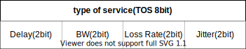
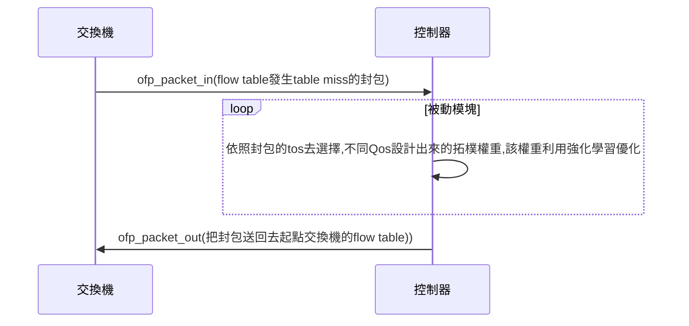
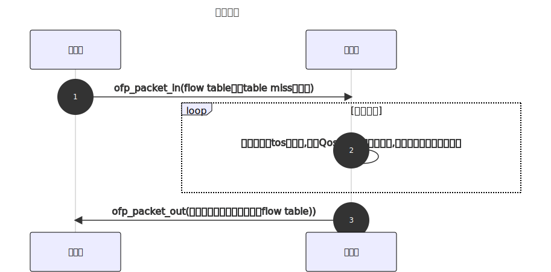
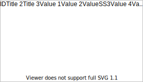

# 動態路由設計方案

## 基於tos Qos規劃

```mermaid
sequenceDiagram
交換機->>控制器: ofp_packet_in(flow table發生table miss的封包)
loop 被動模塊
    控制器->>控制器: 依照封包的tos去選擇,不同Qos設計出來的拓樸權重,該權重利用強化學習優化
end
控制器->>交換機: ofp_packet_out(把封包送回去起點交換機的flow table))
```

